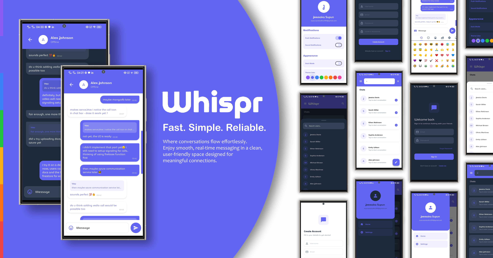
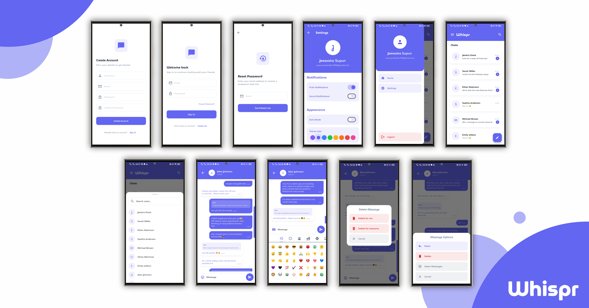
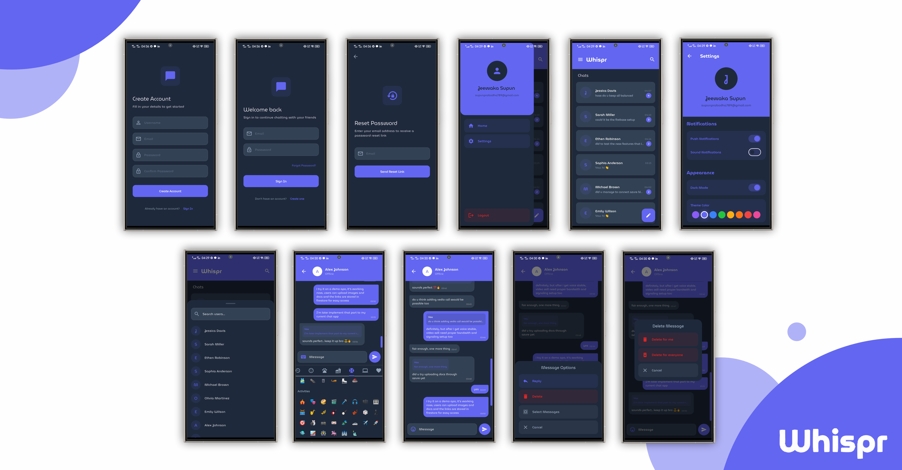

# 🗣️ Whispr

Whispr is a modern, feature-rich chat application built with Flutter and Firebase, offering a seamless and intuitive messaging experience with customizable themes.



## ✨ Features

- 🎨 **Beautiful UI**: Clean, modern interface with light and dark themes
- 🔐 **Authentication**: Secure account creation, login and password reset
- 💬 **Real-time Messaging**: Instant message delivery powered by Firebase
- 🗑️ **Message Management**: Delete messages for yourself or everyone
- 🌈 **Theme Options**: Multiple color schemes to personalize your experience
- 🔔 **Push Notifications**: Stay updated with new messages
- 😊 **Emoji Support**: Express yourself with a wide range of emojis
- ⚡ **Fast & Responsive**: Smooth performance across devices

## 📱 Screenshots

<table>
  <tr>
    <td></td>
    <td></td>
    <td></td>
  </tr>
</table>

## 🛠️ Tech Stack

- 📱 **Frontend**: Flutter SDK
- 🧩 **State Management**: Provider
- ☁️ **Backend**: Firebase (Authentication, Firestore, Cloud Messaging)
- 💾 **Local Storage**: Shared Preferences
- 🔔 **Notifications**: Flutter Local Notifications
- ⚡ **Reactive Programming**: RxDart

## 📂 Project Structure

```
lib/
├── main.dart                      # App entry point
├── components/                    # Reusable UI components
│   ├── emoji_picker_panel.dart    # Emoji selection panel
│   ├── my_button.dart             # Custom button widget
│   ├── my_drawer.dart             # Navigation drawer
│   ├── my_textField.dart          # Custom text input
│   └── user_tile.dart             # User list item
├── models/                        # Data models
├── pages/                         # App screens
│   ├── message_page.dart          # Chat conversation screen
│   ├── forgot_password_page.dart  # Password recovery
│   ├── home_page.dart             # Main screen
│   ├── login_page.dart            # Login screen
│   ├── register_page.dart         # Sign up screen
│   └── settings_page.dart         # User preferences
├── services/                      # Backend services
│   ├── auth_dart.dart             # Authentication
│   ├── auth_service.dart          # Auth helpers
│   ├── login_or_register.dart     # Auth flow management
│   ├── chat_service.dart          # Messaging functionality
│   └── notification_service.dart  # Push notifications
└── themes/                        # App styling
    ├── theme_dart.dart            # Theme configuration
    ├── custom_color.dart          # Color schemes
    └── firebase_options.dart      # Firebase setup
```

## 🚀 Getting Started

### Prerequisites

- 📦 Flutter SDK (3.6.1 or later)
- 📦 Dart SDK (3.6.1 or later)
- 🔥 Firebase project

### Installation

1. Clone the repository:
```bash
git clone https://github.com/J33WAKASUPUN/Whispr-Chat-Application-.git
cd whispr
```

2. Install dependencies:
```bash
flutter pub get
```

3. Set up Firebase:
   - Create a new Firebase project
   - Add Android & iOS apps in Firebase console
   - Download and add the google-services.json and GoogleService-Info.plist files
   - Enable Authentication, Firestore, and Cloud Messaging

4. Run the app:
```bash
flutter run
```

## 🔥 Firebase Configuration

The app requires the following Firebase services:
- 🔐 Authentication with Email/Password
- 📊 Cloud Firestore for message storage
- 🔔 Cloud Messaging for push notifications

## 🔮 Future Enhancements

- 📞 Voice and video calling
- 🔒 End-to-end encryption
- 📎 File sharing
- 👥 Group chats
- ✓✓ Read receipts
- 🚫 User blocking
- 🔍 Message search functionality

## 🤝 Contributing

Contributions are welcome! Please feel free to submit a Pull Request.

1. Fork the repository
2. Create your feature branch (`git checkout -b feature/amazing-feature`)
3. Commit your changes (`git commit -m 'Add some amazing feature'`)
4. Push to the branch (`git push origin feature/amazing-feature`)
5. Open a Pull Request

## 📄 License

This project is licensed under the MIT License - see the [LICENSE](LICENSE) file for details.
